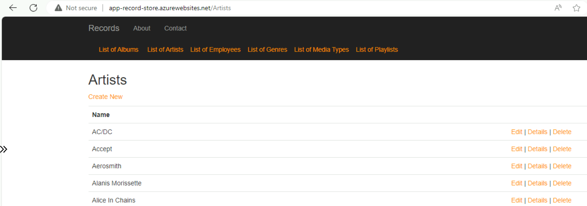
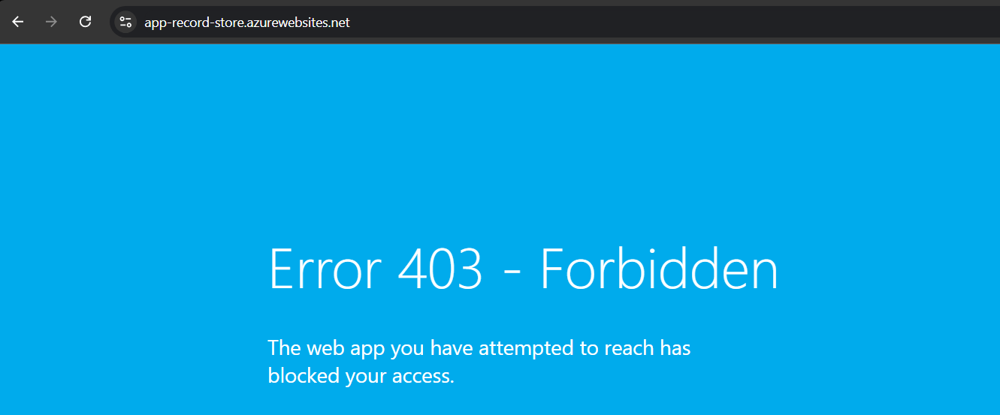

# App on Azure with Advanced Configurations

This repository automates the deployment of the [Record Store Application](https://github.com/MaryKroustali/record_store_app) on Azure with private connectivity and a comprehensive set of resources for a secure and scalable infrastructure.

## Private Connectivity
This deployment ensures all resources operate privately within the VNet, avoiding public exposure. Here's how private connectivity is achieved:

### Private Endpoints

Private endpoints are used to enable private IP-based access to resources such as SQL Server, App Service and Key Vault within the VNet. Each private endpoint is associated with a Network Interface Card (NIC), which is assigned a private IP address from the VNet's address space. This ensures that access to the resource occurs entirely within the private network.

### Azure Private DNS Zones

Azure Private DNS Zones provide name resolution for private endpoints, ensuring seamless connectivity without requiring public IPs. DNS zones are configured to map resource names (e.g. app-record-store.azurewebsites.net) to their private IPs.
This enables applications within the VNet to access resources using standard DNS names.

### Private DNS Zone Groups

The Private DNS Zone Group acts as a bridge between the private endpoint and the private DNS zone, creating and managing DNS records for private connectivity. A DNS record is automatically created in the Private DNS Zone for the private IP associated with the endpoint, mapping the private IP to the DNS name.

### Virtual Network Links

For the Private DNS Zones to resolve records within the network, the Private DNS Zone must be linked to all relevant VNets using Virtual Network Links. The Virtual Network Link ensures that all VNets in the topology can resolve the private IPs of resources mapped in the DNS zone.

### Connectivity Demonstration

To access the Record Store Application URL https://app-record-store.azurewebsites.net is used, where `privatelink.azurewebsites.net` is a Private DNS Zone.

Application accessed within the private VNet, using the Virtual machine.

Access denied when attempting to connect from outside the VNet, over Internet.

## Resource Groups Overview

The deployment is organized into four Azure Resource Groups (RGs) using Bicep templates located in [bicep/rgs/](./bicep/rgs/), with each RG handling a specific area of responsibility. The structure ensures modularity and clarity in resource management. The architecture deployed is the following:

### 1. Network Infrastructure RG (`rg-network-infra-record-store`)

This resource group sets up the private network infrastructure, ensuring secure communication between resources:

- Private Virtual Network (VNet): Hosts all resources within a secure, isolated network.
- Private DNS Zones: Manages DNS resolution for private endpoints within the network.
- Azure Bastion Host: Provides secure RDP/SSH access to virtual machines without exposing them to the internet.
- Private Endpoints: Configures private access for resources like Azure SQL Database and App Service.

### 2. Common Infrastructure RG (`rg-common-infra-record-store`)

This RG includes shared resources essential for operations:

- Key Vault: Stores sensitive information such as SQL and VM credentials.
- Log Analytics Workspace: Centralized logging and monitoring for Application Insights.
- Virtual Machine (Jump Host/GitHub Runner): Functions as a bastion host for accessing internal resources securely. Additionally, serves as a GitHub Runner to execute workflows for managing private resources like the application and database.

### 3. Application Infrastructure RG (`rg-application-infra-record-store`)

This RG contains resources directly related to the application:

- App Service Plan: Hosts the App Service.
- App Service: Deploys the Record Store application.
- Application Insights: Provides performance monitoring, diagnostics and telemetry for the application.

### 4. Database Infrastructure RG (`rg-database-infra-record-store`)

This RG manages the database infrastructure:

- Azure SQL Server: Hosts the application database.
- Application Database: The core database used by the Record Store application.

### Deployment Modules

All resources are defined in reusable Bicep modules located in the [bicep/modules](./bicep/modules/) directory, organized by resource type (e.g. network, webapp, sql). This modular approach ensures consistency, reusability and clarity across deployments.

## GitHub Actions
The deployment process is orchestrated through GitHub Actions workflows, located in the [.github/workflows/](./.github/workflows/) directory, similar to the workflows in the [App on Azure CICD Repository](https://github.com/MaryKroustali/app_on_azure_cicd).

### Workflows

- [Deploy Infrastructure](.github/workflows/deploy_infra.yaml): This workflow is organized into four jobs, with dependencies structured as follows:

- [Import Data to Database](.github/workflows/import_db_data.yaml) and [Deploy Application Code](.github/workflows/deploy_app_code.yaml) workflows are both using `runs-on: self-hosted` to run securely on the virtual machine provisioned within the private network.

  

#### Authentication

Authentication to Azure follows the same process as described in the [App on Azure CICD Repository](https://github.com/MaryKroustali/app_on_azure_cicd). Additionally, the following secrets the following secrets are required:

- `SQL_SERVER_ADMIN_USERNAME`: Admin password for Azure SQL Server. This value can be retrieved from Key Vault.
- `SQL_SERVER_ADMIN_PASSWORD`: Admin username for Azure SQL Server. This value can be retrieved from Key Vault.
- `VM_ADMIN_USERNAME`: Admin username for the virtual machine. This value can be retrieved from Key Vault.
- `VM_ADMIN_PASSWORD`: Admin password for the virtual machine. This value can be retrieved from Key Vault.
- `PAT`: A Personal Access Token (with repo scope) to configure and register the self-hosted GitHub Runner.

### GitHub Runner

The private GitHub Runner, hosted on the VM, is configured to securely execute workflows that require access to private Azure resources. This setup ensures sensitive operations, such as deploying the application and managing the Azure SQL database, are conducted entirely within the private network, avoiding public exposure.

#### Configuration Script

The [scripts/buildagent.ps1](./scripts/buildagent.ps1) is used to configure the private GitHub Runner on the VM. It is deployed as part of the VM setup using the Custom Script Extension, as defined in this [Bicep template](./bicep/modules/vm/windows.bicep). The script:

- Follows the instructions provided under `Github Repository Settings > Actions > Runners > New self-hosted runner (Windows)` to register the runner with the repository.

- Installs the Azure CLI tool, which is essential for running workflow jobs that leverage the `azure/login@v1` action.

# Next Steps
[container_app_on_azure](https://github.com/MaryKroustali/container_app_on_azure): Deploying the Record Store application containerized on Azure.
